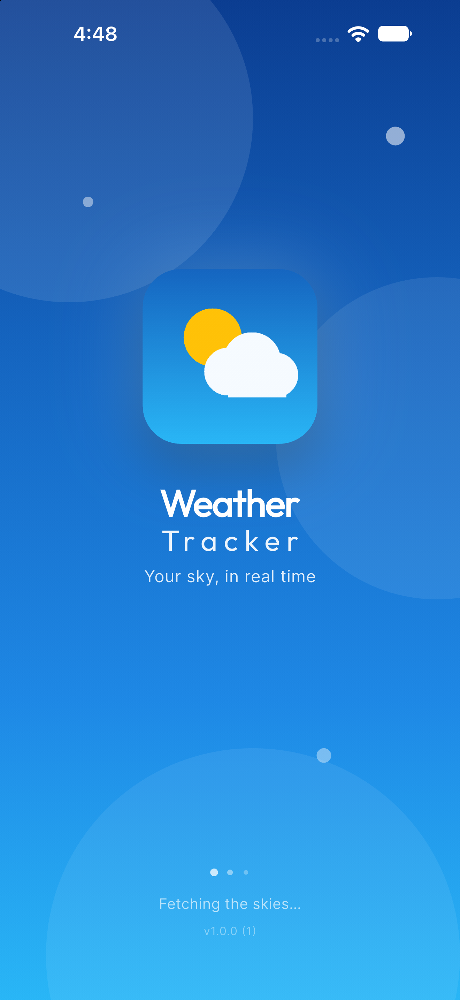
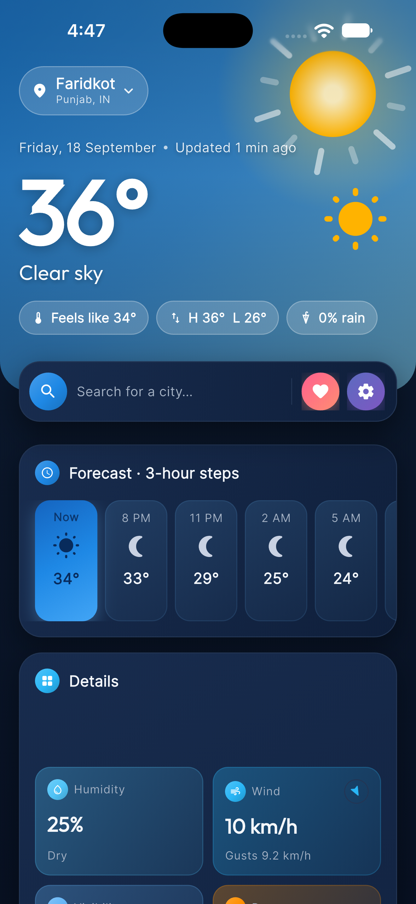
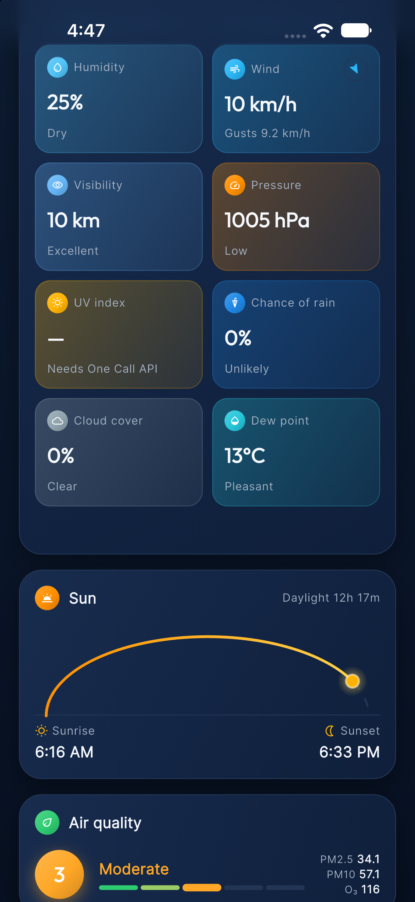
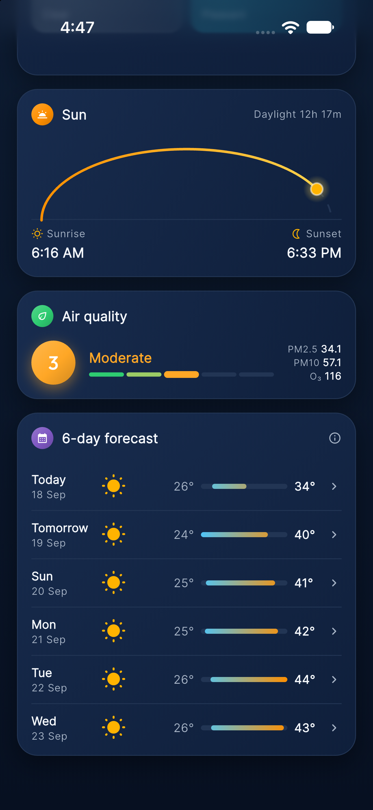
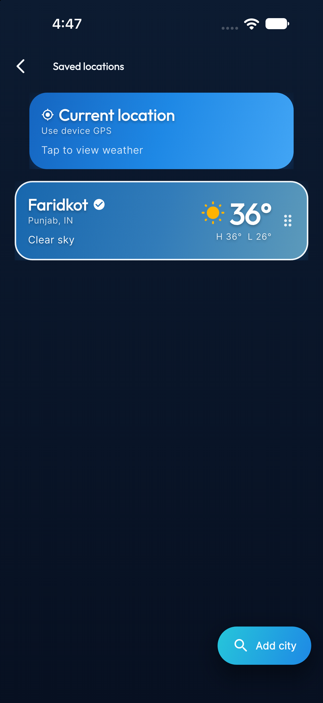
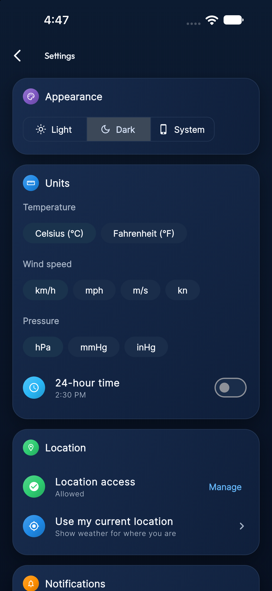

<div align="center">


# Weather Tracker

**Your sky, in real time.**

A premium, production-ready weather app built with **Flutter** and **GetX** — live conditions,
hourly & multi-day forecasts, saved locations, air quality, severe-weather alerts and full
offline support, wrapped in a Material 3 UI whose gradients and animations follow the weather.

[](https://flutter.dev)
[](https://dart.dev)
[](https://pub.dev/packages/get)
[](https://openweathermap.org)
[](#)
[](LICENSE)

</div>

---

## ✨ Screenshots

<div align="center">
<table>
  <tr>
    <td align="center"><br/><sub><b>Animated splash</b></sub></td>
    <td align="center"><br/><sub><b>Dashboard · live weather scene</b></sub></td>
    <td align="center"><br/><sub><b>Details · sun arc · air quality</b></sub></td>
  </tr>
  <tr>
    <td align="center"><br/><sub><b>Multi-day forecast</b></sub></td>
    <td align="center"><br/><sub><b>Saved locations</b></sub></td>
    <td align="center"><br/><sub><b>Settings</b></sub></td>
  </tr>
</table>
</div>

---

## 🌤 Features

| | |
|---|---|
| 🎬 **Living header** | A procedurally-painted scene reacts to the weather — rotating sun rays, drifting clouds, falling rain, swaying snow, lightning strikes, twinkling stars & moon, drifting mist. No Lottie or GIF assets. |
| 🎨 **Condition-driven gradients** | Header, cards, tiles and buttons all use a theme-aware gradient system with full **light & dark mode**. |
| 📍 **Smart location** | GPS with graceful handling of denied / blocked / disabled states, a configurable **fallback city**, and one-tap return to "my location". |
| ⏱ **Hourly forecast** | Next 24 h with the current hour highlighted and precipitation probability. |
| 📅 **Multi-day forecast** | Temperature-range bars scaled to the week; tap a day for the full breakdown. |
| 📊 **Details grid** | Humidity, wind (with compass), visibility, pressure, UV index, rain chance, cloud cover, dew point — each with plain-language context. |
| 🌅 **Sun arc** | Sunrise / sunset with the sun's live position and daylight duration. |
| 🍃 **Air quality** | AQI scale with PM2.5, PM10 and O₃. |
| ⚠️ **Severe-weather alerts** | Colour-coded by severity with full descriptions (One Call 3.0). |
| ❤️ **Saved locations** | Gradient summary cards, tap to switch, swipe to remove (with undo), drag to reorder. |
| ⚙️ **Settings** | Theme, °C/°F, wind & pressure units, 24-hour clock, location status, notification preferences, data clearing, About page. |
| 📴 **Offline first** | Every response is cached per location; the app opens instantly with cached data, refreshes in the background and shows an offline banner when needed. |
| 🛡 **Bulletproof errors** | No internet, timeouts, invalid/missing API key, rate limits, server errors, city not found, empty responses — each with a specific message and the right recovery action. |

---

## 🏗 Architecture

Clean, layered and GetX-driven. Controllers hold state, repositories own data, providers talk HTTP.

```
lib/
├── main.dart                     # Guarded bootstrap (boot-error screen instead of a black screen)
├── app/
│   ├── app_initializer.dart      # env → storage → settings → connectivity, before runApp
│   ├── bindings/                 # App-wide DI (ApiClient, providers, repositories, services)
│   ├── routes/                   # Named routes + page table with per-module bindings
│   └── theme/                    # Material 3 themes, gradients, typography, weather gradients
├── core/
│   ├── config/                   # .env access (never hard-coded secrets)
│   ├── constants/                # API paths, storage keys, feature flags
│   ├── network/                  # Dio client + sealed ApiException hierarchy
│   ├── services/                 # Storage, settings, connectivity, location
│   ├── utils/                    # Unit conversion, date formatting, weather math
│   └── widgets/                  # Reusable UI incl. the animated weather scene
├── data/
│   ├── models/                   # Immutable models with JSON round-trip for caching
│   ├── providers/openweather/    # Raw OWM endpoints + pure JSON→model mappers
│   └── repositories/             # WeatherRepository (swappable), cache, locations
└── modules/                      # One feature per folder: bindings / controllers / views / widgets
    ├── splash/  ├── home/  ├── favorites/  ├── settings/
    ├── search/  ├── forecast/  ├── weather_details/  ├── map/
```

**Data flow**

```
UI (Obx)  ⇄  GetxController  →  WeatherRepository  →  OpenWeatherProvider  →  ApiClient (Dio)
                                       ↓
                                  WeatherCache (GetStorage)
```

Swapping the weather provider means implementing `WeatherRepository` once — controllers and UI stay untouched.

---

## 🚀 Getting started

**Prerequisites:** Flutter 3.38+, an [OpenWeatherMap API key](https://home.openweathermap.org/api_keys), Xcode 15+ / Android SDK 34+.

```bash
git clone <your-repo-url> weathertracker
cd weathertracker

flutter pub get

# Configure the API key (never committed)
cp .env.example .env
#   → set OPENWEATHER_API_KEY=your_key

# Optional: generate launcher icons from assets/images/logo.png
dart run flutter_launcher_icons

flutter run
```

### API configuration

| Variable | Required | Description |
|---|---|---|
| `OPENWEATHER_API_KEY` | ✅ | Your OpenWeatherMap key. New keys can take up to ~2 h to activate (401 until then). |
| `OPENWEATHER_BASE_URL` | – | Defaults to `https://api.openweathermap.org`. Point at a proxy if needed. |
| `OPENWEATHER_USE_ONE_CALL` | – | `true` if your key has **One Call 3.0** access. Otherwise the free endpoints are used with graceful fallbacks. |

| Capability | Free tier | One Call 3.0 |
|---|---|---|
| Current conditions | `/data/2.5/weather` | `/data/3.0/onecall` |
| Hourly | 3-hour steps (5-day forecast) | 48 × 1-hour |
| Daily | 5–6 days, aggregated locally | 7 days |
| UV index | — | ✅ |
| Dew point | computed (Magnus formula) | ✅ |
| Severe alerts | — | ✅ |
| Air quality | ✅ `/data/2.5/air_pollution` | ✅ |

Optional features (map, notifications, air quality, alerts) are toggled in
[`lib/core/constants/feature_flags.dart`](lib/core/constants/feature_flags.dart);
the GPS fallback city lives in [`app_constants.dart`](lib/core/constants/app_constants.dart).

### iOS notes
- Deployment target is **iOS 15**; the project uses the **UIScene** lifecycle required by the iOS 26+ SDK.
- On the simulator set a position via **Features → Location** so GPS has something to return.

---

## 🧰 Tech stack

| Purpose | Package |
|---|---|
| State, routing, DI | [`get`](https://pub.dev/packages/get) |
| HTTP | [`dio`](https://pub.dev/packages/dio) |
| Local storage | [`get_storage`](https://pub.dev/packages/get_storage) |
| Secrets | [`flutter_dotenv`](https://pub.dev/packages/flutter_dotenv) |
| Location | [`geolocator`](https://pub.dev/packages/geolocator) |
| Connectivity | [`connectivity_plus`](https://pub.dev/packages/connectivity_plus) |
| Maps | [`flutter_map`](https://pub.dev/packages/flutter_map) (OpenStreetMap + OWM tiles) |
| Notifications | [`flutter_local_notifications`](https://pub.dev/packages/flutter_local_notifications) |
| Typography | [`google_fonts`](https://pub.dev/packages/google_fonts) — Outfit + Inter |
| Motion | [`flutter_animate`](https://pub.dev/packages/flutter_animate), custom `CustomPainter` scene |

---

## 🧪 Testing

```bash
flutter analyze
flutter test
```

Pure-Dart unit tests cover unit conversion, timezone-aware date formatting, condition → gradient
mapping, network error mapping, the OpenWeatherMap JSON mappers (including free-tier daily
aggregation) and the cache round-trip.

---

## 🗺 Roadmap

- [x] Architecture, theming, animated splash
- [x] Home dashboard with live data & animated weather scene
- [x] Offline cache, connectivity awareness, GPS fallback
- [x] Saved locations
- [x] Settings & About
- [ ] City search with suggestions & recent searches
- [ ] Forecast & weather-details screens
- [ ] Weather map (precipitation / clouds / temperature layers)
- [ ] Daily summary & severe-alert notifications
- [ ] Home-screen widgets

---

## 🤝 Contributing

Issues and pull requests are welcome. Please run `dart format .`, `flutter analyze` and
`flutter test` before opening a PR.

## 📄 License

MIT — see [LICENSE](LICENSE).

<div align="center"><sub>Weather data © <a href="https://openweathermap.org">OpenWeatherMap</a> · Map tiles © OpenStreetMap contributors</sub></div>
# weather_tracker
